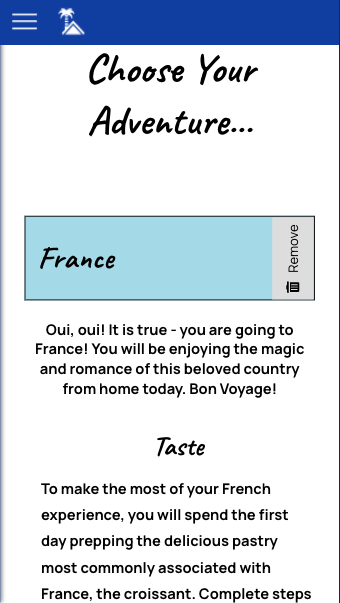

<h1>home holiday<h1>

*Live DEMO*: https://home-holiday.now.sh/

## Description

Home holiday is a virtual trip itinerary generator that inspires authentic connection among friends and family.  Users can choose from carefully created experiences that will immerse them in the spirit of their "destination" or create itineraries of their own.  Key user features include tracking trip completion status and giving feedback on trips by giving or taking away 'kudos'.

## Server

Supported by home holiday API hosted here: https://home-holiday-api.herokuapp.com/

## Screenshots

Navigation:

Dashboard Stats:

Trips List:

Add Trip Form:

## Technology

* React
* JavaScript
* HTML5
* CSS3
* Testing: Mocha / Chai / Supertest